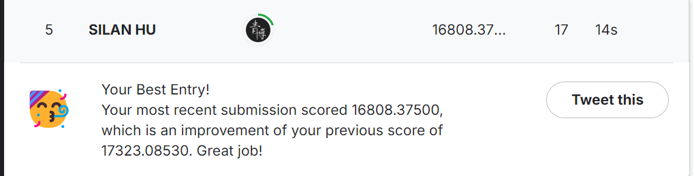

# cs5228 - group20 Car Price Prediction Project

## Table of Contents

- [Project Overview](#project-overview)
- [Project Structure](#project-structure)
- [Environment Setup](#environment-setup)
- [Dataset](#dataset)
- [Running the Project](#running-the-project)
  - [Reproducing Release Results](#reproducing-release-results)
- [Project Components](#project-components)
- [Configuration](#configuration)
- [Future Work](#future-work)
- [Contact](#contact)
- [Acknowledgments](#acknowledgments)

## Project Overview




Accurately predicting resale prices in the used car market is crucial for both sellers and buyers to make informed decisions. This project presents a comprehensive machine learning framework for forecasting used car prices in Singapore using data from SGCarMart. The dataset includes 29 attributes across 25,000 training records and 10,000 test records.

We implemented and compared four state-of-the-art gradient boosting models:

- **XGBoost**
- **LightGBM**
- **CatBoost**
- **Gradient Boosting**

Additionally, we conducted an in-depth error analysis, identifying key performance patterns and feature impacts across different error ranges. To enhance prediction accuracy, we developed an ensemble strategy that combines specialized models for each error category, resulting in a 7% reduction in RMSE compared to individual models. Further integration of residual errors into model retraining led to an additional 5% improvement. This study offers a scalable and generalizable framework for price prediction with significant implications for various regression tasks.

%20(1).png)

## Project Structure

```
├─ data
│  ├─ cleaned-1-10-10
│  ├─ for-experiment-raw
│  ├─ raw
│  └─ __pycache__
├─ final_report
│  ├─ approach1
│  │  ├─ error_cluster
│  │  │  ├─ cluster
│  │  │  │  └─ __pycache__
│  │  │  └─ __pycache__
│  │  ├─ without_cluster
│  │  │  ├─ error_analysis
│  │  │  │  ├─ mistake_analysis_catboost
│  │  │  │  │  └─ heatmaps_catboost
│  │  │  │  ├─ mistake_analysis_gradient_boosting
│  │  │  │  │  └─ heatmaps_gradient_boosting
│  │  │  │  ├─ mistake_analysis_lightgbm
│  │  │  │  │  └─ heatmaps_lightgbm
│  │  │  │  ├─ mistake_analysis_xgboost
│  │  │  │  │  └─ heatmaps_xgboost
│  │  │  │  ├─ plots
│  │  │  │  ├─ reports
│  │  │  │  └─ __pycache__
│  │  │  ├─ log
│  │  │  ├─ models
│  │  │  │  └─ __pycache__
│  │  │  └─ predictions
│  │  └─ __pycache__
│  ├─ approach2
│  │  └─ __pycache__
│  ├─ approach3
│  │  └─ __pycache__
│  └─ preprocessing
│      ├─ kaggle_data
│      │  └─ ver2
│      │      ├─ images
│      │      └─ __pycache__
│      └─ self_experiment
│          └─ ver2
│              ├─ images
│              └─ __pycache__
├─ l2_datasets
├─ midterm-report
├─ our_work
│  └─ silan
│      ├─ catboost
│      │  └─ __pycache__
│      ├─ ensemble
│      ├─ GradientBoosting
│      ├─ lightgbm
│      ├─ NN
│      ├─ release
│      ├─ SVR
│      ├─ WeightedEnsembleL2
│      └─ XGBoosting
└─ preprocessing
    ├─ 2024-10-10-silan
    │  ├─ images
    │  └─ __pycache__
    ├─ 2024-10-21-silan
    │  ├─ images
    │  └─ __pycache__
    ├─ 2024-10-22-silan
    │  ├─ images
    │  └─ __pycache__
    ├─ 2024-10-23-silan
    │  ├─ images
    │  ├─ imputation_models
    │  └─ __pycache__
    ├─ 2024-10-27-silan
    ├─ 2024-10-30-silan
    │  ├─ images
    │  └─ __pycache__
    ├─ 2024-11-1-silan
    │  ├─ images
    │  └─ __pycache__
    ├─ 2024-11-2-silan
    │  ├─ images
    │  └─ __pycache__
    ├─ 2024-11-7-silan
    │  └─ __pycache__
    └─ release
        ├─ ver1
        │  └─ images
        └─ ver2
            ├─ images
            └─ __pycache__
```

## Environment Setup

Ensure you have the following software and libraries installed:

- **Python 3.8+**
- **Libraries:**
  - pandas
  - numpy
  - scikit-learn
  - XGBoost
  - LightGBM
  - CatBoost
  - matplotlib
  - seaborn

You can install all dependencies using the `requirements.txt` file:

```bash
pip install -r requirements.txt
```

## Dataset

The dataset is stored in the `data/raw` directory, comprising 25,000 training records and 10,000 test records. Cleaned data is available in the `data/cleaned-1-10-10` directory. Ensure that all data preprocessing steps are completed and data is correctly placed in the respective directories before running the models.

## Running the Project

### Reproducing Release Results

To reproduce the release results, run the `__main__for_final_report.py` script. This script integrates the main functions from different approaches to generate the final prediction results.

#### Steps to Run:

1. **Ensure Data is Preprocessed:**

   - Make sure all datasets are preprocessed and stored in the appropriate directories as per the project structure.
2. **Install Dependencies:**

   - Install all necessary libraries using the instructions provided in the [Environment Setup](#environment-setup) section.
3. **Run the Script:**

   Execute the following command in your terminal:

   ```bash
   python __main__for_final_report.py
   ```

#### Script Content:

```python
from final_report.approach1.train_and_evalute import switch_main as approach1_main
from final_report.approach1.without_cluster.error_analysis import main as approach1_without_cluster_error_analysis
# from final_report.approach1.cluster.cluster_base_on_error_train_and_evalute import main as approach1_cluster_main   
# from final_report.approach1.cluster.cluster_base_on_feature_train_and_error import main as approach1_cluster1_main
from final_report.approach2.sample_essemble import main as approach2_main
from final_report.approach3.sample_essemble_make_ref_price import main as approach3_main

if __name__ == "__main__":
    # """
    # Approach One: Train and evaluate the model based on the given model name.
    # 'xgboost': XGBoost
    # 'lightgbm': LightGBM
    # 'catboost': CatBoost
    # 'gradientboost': GradientBoosting
    # """
    # approach1_main('gradientboost')
  
    # """
    # Approach One Error Analysis
    # Please train all models before running this function
    # """
    # approach1_without_cluster_error_analysis()
  
    # """
    # If you are interested in clustering, you can run the following code
    # """
    # approach1_cluster_main() # cluster_base_on_error_train_and_evalute.py
    # approach1_cluster1_main() # cluster_base_on_feature_train_and_error.py
  
    # """
    # Approach Two: Sample Ensemble
    # """
    # approach2_main()
  
    # """
    # Approach Three: Sample Ensemble Make Ref Price
    # """
    approach3_main()

# Adjust dataset usage and other configurations in the .env file
```

**Note:** Uncomment the relevant sections in the script to execute different approaches as needed.

## Project Components

### Data

- **`data/`**: Contains raw and cleaned datasets.
  - **`raw/`**: Original raw data.
  - **`for-experiment-raw/`**: Data for experimental purposes. split 25000 to 20000 and 5000

### Final Report

- **`final_report/`**: Includes all methodologies and analyses for the final report.
  - **`approach1/`**: First approach involving error clustering and error analysis without clustering.
    - **`error_cluster/`**: Contains clustering scripts and caches.
    - **`without_cluster/`**: Contains error analysis for different models without clustering.
      - **`error_analysis/`**: Detailed error analysis for each model with corresponding heatmaps.
      - **`log/`**: Log files.
      - **`models/`**: Trained models.
      - **`predictions/`**: Prediction outputs.
  - **`approach2/`**: Second approach focusing on model ensemble design.
  - **`approach3/`**: Third approach utilizing error prediction to enhance model performance.
  - **`preprocessing/`**: Data preprocessing scripts and results for final report.

### Our Work

- **`our_work/`**: Individual contributions and implementations by team members.
  - **`silan/`**: Specific implementations by HU Silan.
    - **`catboost/`**, **`GradientBoosting/`**, **`lightgbm/`**, **`NN/`**, **`SVR/`**, **`XGBoosting/`**: Different model implementations.
    - **`ensemble/`**, **`WeightedEnsembleL2/`**: Ensemble methods.
    - **`release/`**: Release versions with images and caches.
  - **`yunlin/`**: Specific implementations by Yulin Huang.(Random Forest)
  - **`weicong/`**: Specific implementations by Pang Weicong.(Gradient Boosting)

### Preprocessing

- **`preprocessing/`**: Logs and results of data preprocessing over different dates.
  - **`YYYY-MM-DD-silan/`**: Preprocessing steps and results for specific dates.
    - **`images/`**: Images and visualizations from preprocessing.
    - **`imputation_models/`**: Models used for data imputation.
    - **`__pycache__/`**: Python cache files.
  - **`release/`**: Release versions with images and caches.

### Other Directories

- **`l2_datasets/`**: Additional datasets at Level 2.
- **`midterm-report/`**: Midterm report documents and analyses.

## Configuration

- **`.env` File:**
  - All dataset paths and configurations are managed through the `.env` file.
  - Ensure that the paths specified in the `.env` file match your local directory structure to avoid data reading errors.
  - Update the `.env` file accordingly when adjusting dataset usage or directory structures.

## Future Work

Building upon the current methodologies, future research will focus on further refining and expanding the approaches to achieve higher levels of predictive accuracy and robustness. Key areas include:

1. **Advanced Feature Engineering:** Explore deeper feature interactions and non-linear transformations.
2. **Enhanced Clustering Techniques:** Investigate more sophisticated clustering algorithms.
3. **Sophisticated Ensemble Methods:** Develop hybrid ensemble strategies combining bagging, boosting, and stacking.
4. **Real-Time Model Updating:** Create mechanisms for continuous learning and real-time model updates.
5. **Interpretable Machine Learning:** Incorporate interpretable machine learning techniques to enhance model transparency.
6. **Cross-Domain Applications:** Apply the methodologies to other domains to validate their versatility.

## Contact

For any questions or suggestions, please contact the project members:

- **Silan Hu**
- **Weicong Pang**
- **Jiajun Yang**
- **Yulin Huang**

## Acknowledgments

We would like to thank the School of Computing, NUS, and SGCarMart for providing the necessary data and resources to carry out this project. Special thanks to all team members for their dedication and hard work.

---

Thank you for your interest in our project!
